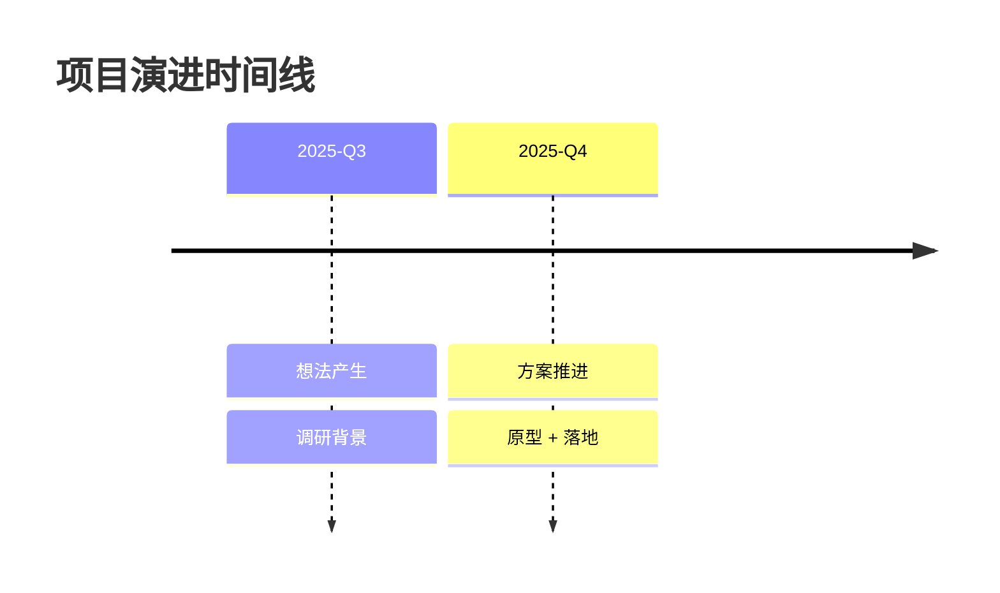
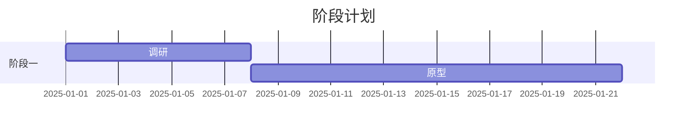

# 调研报告 R1-03：GitHub 版本归档 与 融合时间的可视化看板

> 来源：后台检索 agent 调研，关键工具与 URL 均已 web 核实。

---

## 一、GitHub 版本控制与归档自动化

### 1.1 git 基础工作流（Obsidian vault / Markdown / 项目文档入库）

**推荐方案**：把整个 vault 目录当做一个 git 仓库，用 `.gitignore` 排除大文件、缓存与隐私目录。

```bash
cd /path/to/vault
git init && git add . && git commit -m "init: vault baseline"
git branch -M main
git remote add origin https://github.com/<you>/<repo>.git
git push -u origin main
# 日常提交
git add -A && git commit -m "阶段成果: <主题>" && git push
```

官方文档：https://git-scm.com/doc

### 1.2 Obsidian Git 插件（自动定时 commit + push）

- 工具：`obsidian-git`（[Vinzent03/obsidian-git](https://github.com/Vinzent03/obsidian-git)）
- 配置要点：
  - 开启 **Auto backup / Auto commit-and-sync**，设置 commit interval（如每 10 分钟）、勾选 **Push on backup**、**Pull before push**（避免冲突）；
  - 认证推荐 GitHub **Personal Access Token (PAT)**，或复用系统 git 凭据/SSH；
  - 冲突用「auto-pull → 保留本地」策略；`.obsidian/workspace.json` 等高频变动文件建议忽略。
- CLI 等价：`git add -A && git commit -m "vault backup" && git push`

### 1.3 GitHub CLI (`gh`) 常用命令

- 官方：https://cli.github.com/ ；手册 https://cli.github.com/manual/

```bash
gh auth login
gh auth status
gh repo create my-vault --private --source=. --remote=origin --push
gh repo view owner/my-vault --web
gh repo list --limit 20

# 阶段成果归档：tag + release
git tag -a v0.1.0 -m "milestone 0.1"
git push origin --tags
gh release create v0.1.0 --title "v0.1.0 阶段成果" --notes "本阶段完成内容…" --generate-notes
gh release list
```

### 1.4 GitHub Actions 自动化（定时备份、生成文档、归档 release）

- 官方：https://docs.github.com/en/actions ；语法 https://docs.github.com/en/actions/reference/workflow-syntax-for-github-actions

定时备份 workflow 示例要点（`cron` + `actions/checkout` + 提交脚本）：

```yaml
name: vault-backup
on:
  schedule:
    - cron: '0 2 * * *'
  workflow_dispatch:
jobs:
  backup:
    runs-on: ubuntu-latest
    steps:
      - uses: actions/checkout@v4
      - run: |
          git config user.name "vault-bot"
          git config user.email "bot@example.com"
          git add -A
          git commit -m "auto backup $(date -u +%FT%TZ)" || echo "nothing to commit"
          git push
```

- 归档 release：社区 action [softprops/action-gh-release](https://github.com/softprops/action-gh-release) 在打 tag 时自动发布；或 `gh release create`（需 `GH_TOKEN: ${{ secrets.GH_TOKEN }}`）。
- 生成文档：workflow 里跑 `pandoc`（MD→HTML/PDF）或从 frontmatter 生成 JSON 看板数据，产物提交到 `gh-pages`（用 [actions/deploy-pages](https://github.com/actions/deploy-pages)）。
- 要点：密钥放 **Repository Secrets**，绝不硬编码进 workflow。

### 1.5 敏感信息处理与归档约定

- `.gitignore` 排除：`.obsidian/workspace*.json`、`.trash/`、`.env`、`*.key`、token、大附件；模板参考 https://github.com/github/gitignore
- 私有仓库：含隐私的 vault 一律 `gh repo create --private`。
- 阶段归档约定：语义化 tag（`v0.1.0`）或日期式（`2025-12-31`）；每个里程碑打 tag + release，release notes 写清「本阶段成果 + 下阶段计划」；长期留痕用 release 快照，日常用 commit 历史。

---

## 二、融合时间的可视化看板

### 2.1 Obsidian 生态插件

| 用途 | 工具 | 要点 | URL |
|---|---|---|---|
| 看板/进度 | **Kanban**（obsidian-community/obsidian-kanban，原 mgmeyers） | 代码块 ` ```kanban ``` `，卡片内可挂注释与内链 | https://github.com/obsidian-community/obsidian-kanban |
| 数据查询 | **Dataview**（blacksmithgu） | `dataview`/`dataviewjs` 查 frontmatter，`dv.pages()` 聚合 | https://github.com/blacksmithgu/obsidian-dataview |
| 图表 | **Obsidian Charts**（phibr0） | ` ```charts ``` ` 从 CSV/JSON 出图 | https://github.com/phibr0/obsidian-charts |
| 图表（进阶） | **Charts View**（caronchen） | ` ```chartsview ``` ` 折线/柱状/饼图 | https://github.com/caronchen/obsidian-chartsview-plugin |
| 日历 | **Calendar**（liamcain） | 右侧日历面板，点击跳转 daily note | https://github.com/liamcain/obsidian-calendar-plugin |
| 热力图 | **Heatmap Calendar**（Richardsl） | GitHub activity 风格热力图 | https://github.com/Richardsl/heatmap-calendar-obsidian |
| 时间线 | **Timeline**（George-debug） | ` ```timeline ``` ` 竖轴时间线 | https://github.com/George-debug/obsidian-timeline |
| 时间线（轻量） | **obsidian-timelive**（aNNiMON） | 日期列表直接变时间轴 | https://github.com/aNNiMON/obsidian-timelive |
| 白板/手绘 | **Excalidraw**（zsviczian） | 无限白板，思维导图/草图 | https://github.com/zsviczian/obsidian-excalidraw-plugin |

> 注：`janily/obsidian-timeline` 未核实到确切 fork，建议以社区插件市场真实 repo 为准（George-debug / aNNiMON）。

### 2.2 时间轴 / 时间线可视化（Mermaid、markwhen）

- **Mermaid timeline / gantt**（Obsidian 原生支持）：语法 https://mermaid.js.org/syntax/timeline.html 、 https://mermaid.js.org/syntax/gantt.html

````markdown



````

- **markwhen**（Markdown 写时间线/甘特）：官网 https://markwhen.com/ 、仓库 https://github.com/mark-when/markwhen 、文档 https://docs.markwhen.com/
- 融合展示：以 frontmatter 的 `date / status / tags / priority / energy` 为统一数据源，用 **Dataview 聚合 → Timeline/Heatmap/Charts 分头渲染**。

### 2.3 「思路注释 / 思维轨迹」可视化

- **卡片挂注释**：Kanban 卡片正文写思路注释、`[[]]` 双链、`#标签` 标记状态。
- **git 风格 diff / 版本演进**：`obsidian-git` 的 **Open History / Diff** 视图看想法笔记从产生到完成的逐版改动，「思维轨迹 = 版本历史」。
- **思维导图 / 白板**：Excalidraw 画导图 + 双向链接；Obsidian 原生 **Canvas** 多卡片白板。
- **结构化轨迹**：Dataview 按 `created/modified/status` 列「想法→推进→完成」各节点与时间戳，Timeline 插件纵向展示演进路径。

### 2.4 其它新颖方案

- **GitHub Projects**：Board / Roadmap / Table 视图，与 issues、PR 联动 —— https://docs.github.com/en/issues/planning-and-tracking-with-projects/learning-about-projects/about-projects
- **Notion 类看板**：Notion Timeline/Gantt；开源替代 AppFlowy / AFFiNE。
- **本地 HTML 时间线**：vis-timeline https://visjs.github.io/vis-timeline/ 、TimelineJS https://timeline.knightlab.com/ 、D3 https://d3js.org/

### 2.5 融合「时间、精力、优先级、标签、想法演进」的成熟模板

- 无单一插件开箱即用融合全部维度，成熟做法是**组合自建**：
  - Kanban（进度/优先级/状态）+ Heatmap Calendar（时间/精力）+ Timeline（想法演进）+ Charts（聚合统计）；
  - 统一数据约定在 frontmatter（`date, status, priority, energy, tags, progress`），Dataview 做单一数据源；
  - 可借鉴 LifeOS / Blue Topaz 等社区 vault 模板，再加时间线+热力图+归档配置。

---

## 三、数据可视化技术选型（本地生成看板 HTML）

### 3.1 纯前端方案对比

| 库 | 定位 | 引入 | URL |
|---|---|---|---|
| **ECharts**（Apache） | 通用图表 + 甘特/日历热力/关系图，中文文档全 | `npm i echarts` 或 CDN | https://echarts.apache.org/ |
| **D3.js** | 最灵活，自定义时间轴/力导向/桑基图 | `npm i d3` 或 CDN | https://d3js.org/ |
| **vis-timeline** | 专业时间轴/甘特（items+groups） | `npm i vis-timeline` 或 CDN | https://visjs.github.io/vis-timeline/ |
| **TimelineJS** | 叙事式时间线，读 JSON/Sheet | JSON + iframe/JS | https://timeline.knightlab.com/ |
| **Mermaid** | 文本图表（timeline/gantt/flowchart） | `npm i mermaid` 或 CDN | https://mermaid.js.org/ |

### 3.2 从 Markdown/JSON 数据源生成可交互看板

- **方案 A（Obsidian 内）**：frontmatter → Dataview(`dataviewjs`) 读成数组 → 注入 Charts/Charts View 代码块出图。
- **方案 B（独立 HTML 看板）**：
  1. 解析：`gray-matter`（frontmatter）+ `markdown-it`（正文）把笔记转 JSON（title/date/status/priority/energy/tags/body）；
  2. 渲染：JSON 喂给 ECharts（热力用 `calendar` 坐标）或 vis-timeline；
  3. 打包：`index.html` + `data.json`，本地双击打开，或 GitHub Pages 发布。
- 最小可跑示例：

```json
{ "events": [ { "title": "想法A", "start": "2025-01-01", "status": "done", "energy": 7, "tags": ["idea","archived"] } ] }
```

```js
// ECharts calendar 热力图核心 option（示意）
option = {
  visualMap: { min: 0, max: 10, orient: 'horizontal', calculable: true },
  calendar: { range: '2025', cellSize: ['auto', 20] },
  series: [{ type: 'heatmap', coordinateSystem: 'calendar',
    data: [['2025-01-01', 7], ['2025-02-03', 4]] }]
};
```

---

## 最推荐落地组合

1. **归档**：Obsidian vault 用 **obsidian-git** 每 10 分钟自动 commit+push 到私有 GitHub 仓库，`.gitignore` 排除隐私。
2. **阶段成果**：每个里程碑用 **`gh release create`** 打语义化 tag + release；GitHub Actions 定时备份并自动归档。
3. **看板**：frontmatter 统一字段（时间/状态/优先级/精力/标签）→ **Kanban + Dataview + Heatmap Calendar + Timeline** 组合展示。
4. **思维轨迹**：**Kanban 卡片挂注释 + obsidian-git Diff 历史** 追踪「想法→推进→完成」，Excalidraw/Canvas 画导图。
5. **本地 HTML 看板**：`gray-matter` 解析 Markdown → JSON → **ECharts**（热力/时间轴）渲染成单文件 `index.html`，可选发布 GitHub Pages。

**关键 URL 速查**：obsidian-git github.com/Vinzent03/obsidian-git · gh cli.github.com · Actions docs.github.com/en/actions · Dataview github.com/blacksmithgu/obsidian-dataview · Kanban github.com/obsidian-community/obsidian-kanban · Charts github.com/phibr0/obsidian-charts · Heatmap github.com/Richardsl/heatmap-calendar-obsidian · Timeline github.com/George-debug/obsidian-timeline · markwhen markwhen.com · Mermaid mermaid.js.org · ECharts echarts.apache.org · vis-timeline visjs.github.io/vis-timeline · TimelineJS timeline.knightlab.com
